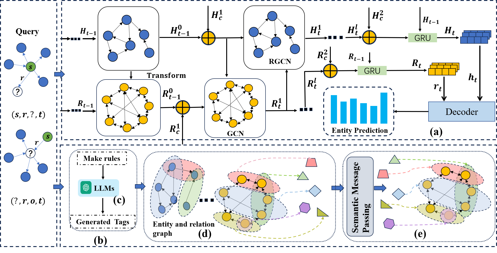

# DSTAG: A Semantic Tag-Enhanced Dual-Graph Convolutional Network for Temporal Knowledge Graph Completion



## Quick Start
### Environment variables & dependencies
```
conda create -n DSTAG python=3.8
conda activate DSTAG
```

### Process data

#### For the four datasets ICEWS18, ICEWS14, ICEWS05-15 and GDELT, go into the dataset folder in the ./data directory and run the following command to construct the static graph.
```
python generate_ent2sec_mat.py
python generate_rel2sec_mat.py

cd ./data/<dataset>
python ent2word.py
```
### Train models

#### Then the following commands can be used to train the proposed models. By default, dev set evaluation results will be printed when training terminates.

#### 1. Make dictionary to save models
```
mkdir models
```
#### 2. Train models
```
cd src
python src/main.py -d ICEWS14 --train-history-len 7 --test-history-len 7 --dilate-len 1 --lr 0.001 --n-layers 2 --evaluate-every 1 --gpu=0 --n-hidden 200 --self-loop --decoder convtranse --encoder uvrgcn --layer-norm --weight 0.5  --entity-prediction --angle 10 --discount 1 --pre-weight 0.9  --pre-type all --add-static-graph  --temperature 0.03
```
#### 2. Test models
```
cd src
python src/main.py -d ICEWS14 --train-history-len 7 --test-history-len 7 --dilate-len 1 --lr 0.001 --n-layers 2 --evaluate-every 1 --gpu=0 --n-hidden 200 --self-loop --decoder convtranse --encoder uvrgcn --layer-norm --weight 0.5  --entity-prediction --angle 10 --discount 1 --pre-weight 0.9  --pre-type all --add-static-graph  --temperature 0.03 --test
```
